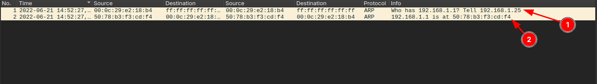
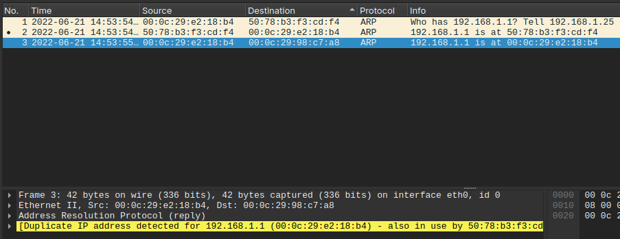
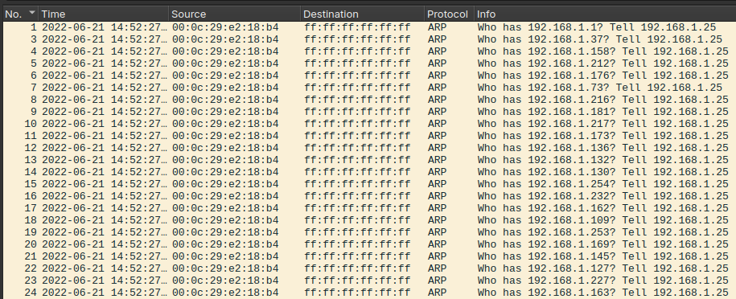
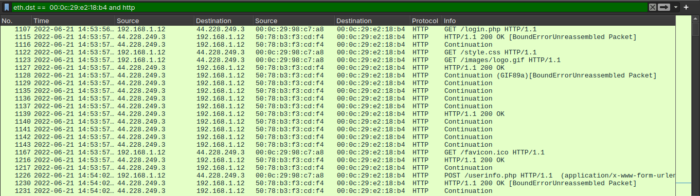
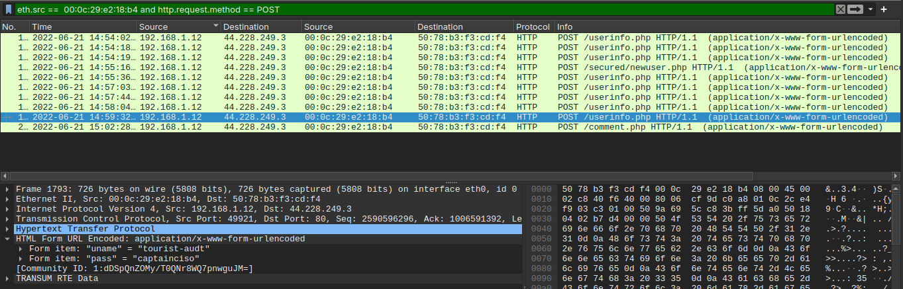

# ARP POISONING ANALYSIS (MITM)

## Introduction

In this repository, I present a practical example of the analysis of a possible ARP Poisoning attack, also known as a Man-In-The-Middle (MITM) attack.

The main objective of this type of attack is to intercept the traffic of a machine or an entire network by manipulating the associations between IP addresses and MAC addresses within the local network.

During the investigation, the following aspects were analyzed:

- ARP protocol behavior;
- anomalies in IP ↔ MAC resolution;
- anomalous volume of ARP requests;
- intercepted HTTP traffic;
- possible credentials transmitted in clear text.

---

## UNDERSTANDING ARP



### Line 1 — ARP Request

The first line shows an ARP request (ARP Request).

This type of packet is sent via broadcast to all devices on the local network with the following purpose:

> “Who owns IP X.X.X.X? Tell Y.Y.Y.Y.”

---

### Line 2 — ARP Response

The second line shows an ARP response (ARP Reply).

Unlike the request, this response is sent directly to the host that made the request, informing:

> “IP X.X.X.X belongs to MAC address XX:XX:XX:XX:XX:XX.”

---

## Basic ARP Behavior

Before analyzing a possible anomaly, it is important to understand the expected behavior of the ARP protocol.

A simple way to visualize this is to imagine an office full of people. You need to deliver a letter to John, but you do not know where he is. So you ask out loud:

> “Who here is John?”

Only John will reply:

> “It’s me.”

ARP works in a similar way:

- the host sends a broadcast request;
- the device that owns the IP responds with its physical address (MAC).

---

## ANOMALY IDENTIFICATION



In the image above, it is possible to observe inconsistent behavior related to the IP `192.168.1.1`.

Initially, the legitimate host responds normally for the association between the IP address and its respective MAC address.

Shortly after, another device — identified by the MAC ending in `b4` — starts announcing that it is also responsible for the IP `192.168.1.1`.

Wireshark itself flags the event as:

> `Duplicate IP address detected`

This behavior is highly suspicious, especially considering that the address `192.168.1.1` is commonly used as the local network gateway.

At this stage of the analysis, there are already strong indicators of:

- ARP Spoofing;
- ARP Poisoning;
- possible Man-In-The-Middle positioning.

---

## POST-DETECTION ANALYSIS

After identifying the inconsistency, the next step was to analyze the behavior of the suspicious host within the network.

For this, I used the following filter:

```text
((arp) && (arp.opcode == 1)) && (arp.src.hw_mac == 00:0c:29:e2:18:b4)
```

The purpose of the filter was to identify the volume of ARP Requests originating from the suspicious MAC address.

!

The result demonstrates a continuous sequence of ARP requests being sent to several network addresses within a short time interval.

This behavior may indicate:

- massive ARP scanning;
- active host discovery attempts;
- behavior compatible with ARP flooding;
- activity related to the preparation of a MITM attack.

Despite the indicators, it is still not possible to immediately confirm malicious activity, since certain network issues may also generate similar anomalous behavior.

However, the observed pattern significantly increases the suspicion level regarding the analyzed host.

---

## HTTP TRAFFIC ANALYSIS

After identifying anomalies in the ARP protocol, the investigation shifted toward HTTP traffic in order to verify possible communication interception.

The following filter was used:

```text
eth.dst == 00:0c:29:e2:18:b4 and http
```

The filter allows visualization of HTTP packets destined for the suspicious MAC address.



The analysis revealed multiple HTTP communications passing through the host identified by the MAC ending in `b4`.

Additionally, inconsistent IP ↔ MAC associations were observed, strengthening the hypothesis that the device was acting as an intermediary between hosts on the network.

At this stage of the investigation, the observed indicators strongly point to a Man-In-The-Middle attack scenario based on ARP Poisoning.

---

## IDENTIFICATION OF EXPOSED CREDENTIALS

After confirming that HTTP traffic was passing through the suspicious host, the next step was to verify whether sensitive data was being transmitted in clear text.

For this purpose, I used the following filter:

```text
eth.src == 00:0c:29:e2:18:b4 and http.request.method == POST
```



During the analysis of HTTP POST packets, it was possible to identify:

- credentials;
- authentication fields;
- data submitted through `application/x-www-form-urlencoded` forms.

Among the observed data were:

- usernames;
- email addresses;
- passwords transmitted without encryption.

The presence of this information confirms the potential impact of the attack, since the intercepted traffic allowed access to sensitive user data within the network.

---

## OBSERVED INDICATORS

During the investigation, the following indicators were identified:

- conflicting ARP responses for the IP `192.168.1.1`;
- multiple inconsistent IP ↔ MAC associations;
- `Duplicate IP Address` alert generated by Wireshark;
- high volume of ARP Requests originating from the same host;
- behavior compatible with ARP scanning/flooding;
- HTTP traffic routed through the suspicious host;
- credentials transmitted in clear text via HTTP POST;
- evidence compatible with a Man-In-The-Middle attack.

---

## CONCLUSION

Based on the analyzed artifacts, the observed indicators strongly point to an ARP Poisoning scenario used for Man-In-The-Middle positioning within the local network.

The analysis demonstrated:

- manipulation of ARP associations;
- anomalous host discovery behavior;
- HTTP traffic interception;
- exposure of credentials in clear text.

The case also highlights the risks of using unencrypted protocols such as HTTP in environments susceptible to interception attacks.

---

## POSSIBLE MITIGATION MEASURES

Some measures that could reduce or prevent this type of attack include:

- using HTTPS instead of HTTP;
- implementing Dynamic ARP Inspection (DAI);
- proper network segmentation;
- continuous monitoring of ARP traffic;
- using IDS/IPS solutions to detect ARP Spoofing;
- adopting static ARP tables in critical environments;
- device authentication within the local network;
- periodic analysis of IP ↔ MAC conflicts.
